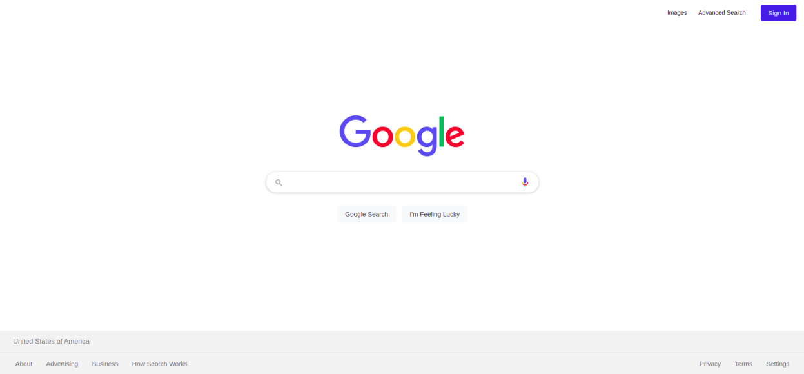
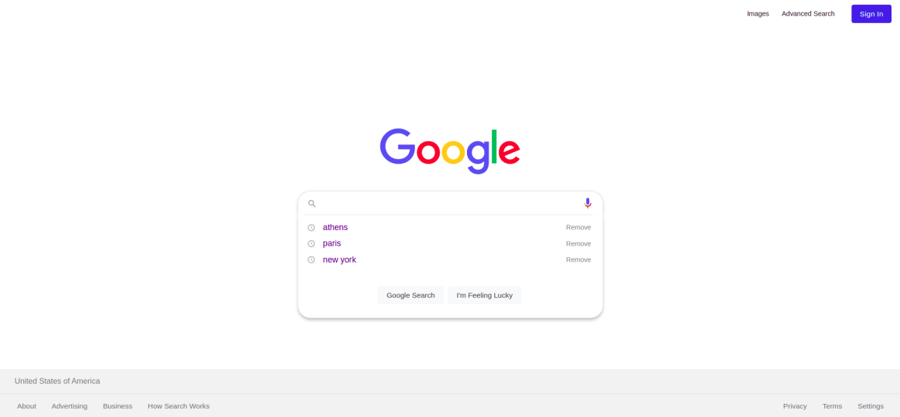
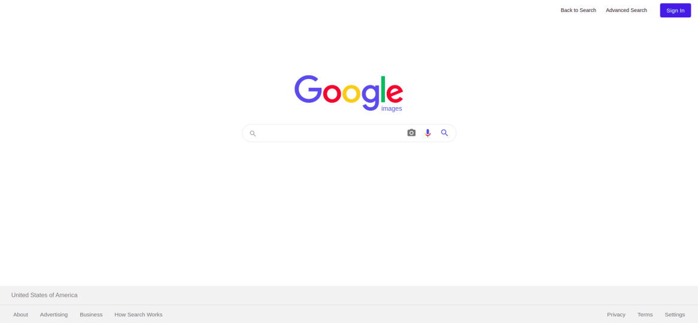
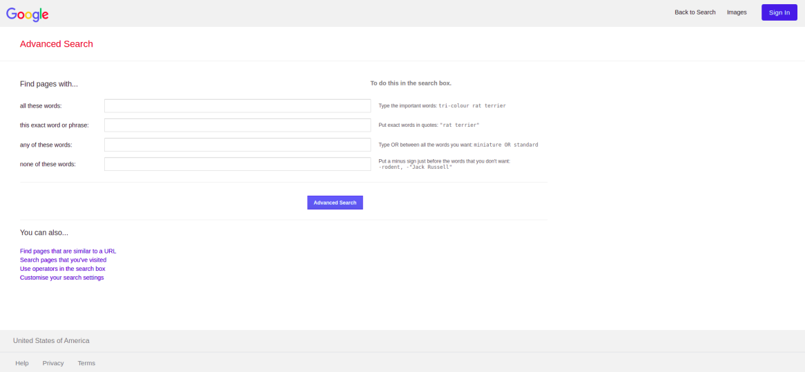

# Google Search Clone
This is a repository containing work for the first project of Harvard's Online course 'CS50's Web Programming with Python and JavaScript'. 

#### Deployment
You can find my implementation at: https://thanoskaravangelis.github.io/google-search-clone/

#### Presentation
You can find a short presentation of this project on [this Youtube link](https://www.youtube.com/watch?v=7beTHQwn5Vw).

# Features
This project's aim is to create a clone for:
* Google Search Clone 

  

> With search history supported:

  

* Google Images Search Clone 

  

 

* Google Advanced Search Clone 

  

# Languages
I used `HTML`,`CSS` and some `Javascript`. 

